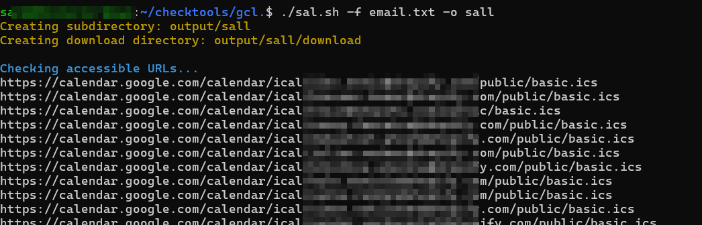
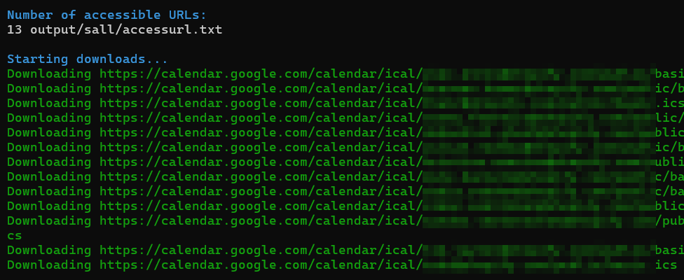
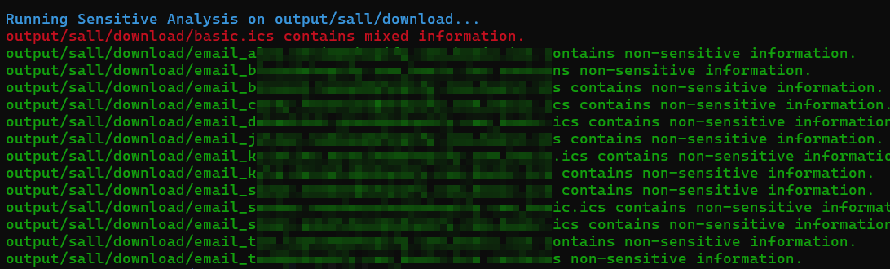

# Calendar Access Checker

This repository contains a suite of tools for checking the accessibility of Google Calendar URLs, downloading their content, and analyzing them for sensitive information.

### Prerequisites
httpx: Install via https://github.com/projectdiscovery/httpx
wget: Install via your package manager (apt, brew, etc.)
go: Install from https://golang.org/dl/

## Tools

1. **Go Script for URL Accessibility**: `go run gcl.go`
2. **Download Script**: `./download.sh`
3. **Analysis Tool**: `go run analyze.go`
4. **Automation Script**: `./autoRun.sh`

## Usage
Run the Script
./autorun.sh -f <email_file> -o <subdirectory>

## Features
URL Checking: Validate the accessibility of URLs based on email addresses.
File Downloading: Download .ics files from accessible URLs.
Data Analysis: Run a Go script to analyze downloaded files.
